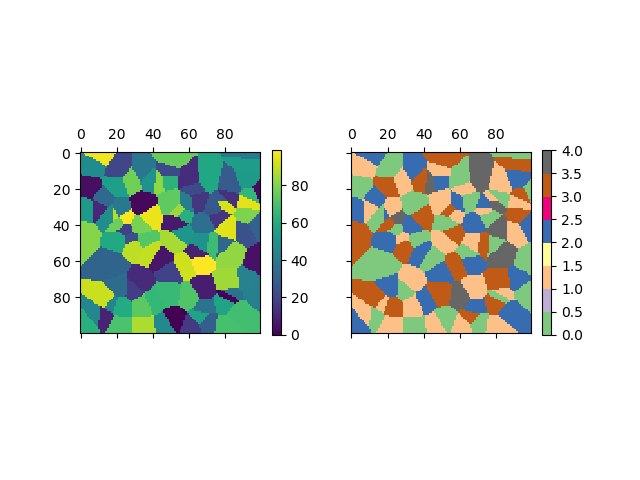

# 4-colors

Simplify a labeled array by reducing the number of colors to color the regions of the map so that no two adjacent regions have the same color. The algorithm does not necessarily the optimal solution with the minimum number of color.

This is related to the [Four color theorem](https://en.wikipedia.org/wiki/Four_color_theorem)

